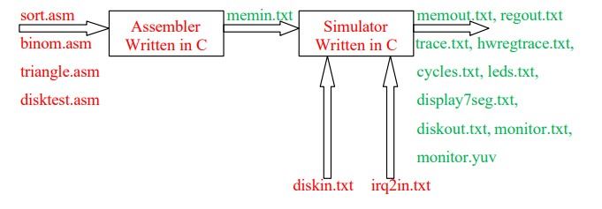

# **Simulator**

In the project we will practice the subjects of computer language, input/output, and also practice our programming skills in the C language. We will implement an assembler and a simulator (separate programs), and write programs in assembly language for a RISC processor called SIMP, which is similar to the MIPS processor but simpler than it.

The simulator will simulate the SIMP processor, as well as a number of I/O devices: bulbs,  7-segment display, a monochromatic monitor with a resolution of 256x256 and a hard disk.

# **Registers**
A SIMP processor contains 16 registers, each of which is 32 bits wide. The names of the registers, their number, and the role of each of them according to the calling conventions, are given in the following table:

|Register Number|Register Name|Purpose|
| :- | :- | :- |
|0|$zero|Constant zero|
|1|$imm|Sign extended imm|
|2|$v0|Result value|
|3|$a0|Argument register|

|4|$a1|Argument register|
| :- | :- | :- |
|5|$a2|Argument register|
|6|$a3|Argument register|
|7|$t0|Temporary register|
|8|$t1|Temporary register|
|9|$t2|Temporary register|
|10|$s0|Saved register|
|11|$s1|Saved register|
|12|$s2|Saved register|
|13|$gp|Global pointer (static data)|
|14|$sp|Stack pointer|
|15|$ra|Return address|

The names of the registers and their role are similar to what we saw in the lecture and exercises for the MIPS processor, with the following differences: the $zero and $imm registers are special registers that cannot be written to, and can be used wherever operand source is used: register $zero is zero identity, register $imm contains the constant field imm, as coded in the assembly instruction. Sign extension instructions that write to $imm, $zero do not change their value.

# **Main memory, the set of instructions and their encoding**
#
The main memory is 20 bits wide and 4096 lines deep. Each instruction is executed in a single clock cycle. The SIMP processor has two instruction encoding formats. Instructions that do not use a constant are coded in one line in memory, where the bit numbers of each field are given in the following table (R format):

|R format||||
| :-: | :- | :- | :- |
|19:12|11:8|7:4|3:0|
|opcode|rd|Rs|Rt|

If a constant is used, the instruction is coded in two consecutive lines (I format):

|I format||||
| :-: | :- | :- | :- |
|19:12|11:8|7:4|3:0|
|opcode|rd|Rs|rt|
|Imm||||

The PC register is 12 bits wide. For advancing to the next instruction (if there is no jump), PC advances by one for the instructions in R format (without the constant), or by two for the instructions in I format (with the constant).

The opcodes supported by the processor and the meaning of each instruction are given in the following table:

|
Opcode

Number
|Name|Meaning|
| :- | :- | :- |
|0|add|R[rd] = R[rs] + R[rt]|
|1|sub|R[rd] = R[rs] – R[rt]|
|2|mul|R[rd] = R[rs] \* R[rt]|
|3|and|R[rd] = R[rs] & R[rt]|
|4|or|R[rd] = R[rs] | R[rt]|
|5|xor|R[rd] = R[rs] ^ R[rt]|
|6|sll|R[rd] = R[rs] << R[rt]|
|7|Ms|R[rd] = R[rs] >> R[rt], arithmetic shift with sign extension|
|8|srl|R[rd] = R[rs] >> R[rt], logical shift|
|9|beq|if (R[rs] == R[rt]) pc = R[rd]|
|10|bne|if (R[rs] != R[rt]) pc = R[rd]|
|11|blt|if (R[rs] < R[rt]) pc = R[rd]|
|12|bgt|if (R[rs] > R[rt]) pc = R[rd]|
|13|ble|if (R[rs] <= R[rt]) pc = R[rd]|
|14|bge|if (R[rs] >= R[rt]) pc = R[rd]|
|15|jal|R[rd] = next instruction address, pc = R[rs]|
|16|lw|R[rd] = MEM[R[rs]+R[rt]], with sign extension|
|17|sw|MEM[R[rs]+R[rt]] = R[rd] (bits 19:0)|
|18|reti|PC = IORegister[7]|
|19|in|R[rd] = IORegister[R[rs] + R[rt]]|
|20|out|IORRegister [R[rs]+R[rt]] = R[rd]|
|21|halt|Halt execution, exit simulator|

# **input / output**
The processor supports input/output through in and out instructions that access the array of "hardware registers" as detailed in the table below. The initial values ​​of the hardware registers at exit from reset are 0.

|
IORRegister

Number
|Name|
Number

bits
|Meaning|
| :- | :- | :- | :- |
|0|irq0enable|1|IRQ 0 enabled if set to 1, otherwise disabled.|
|1|irq1enable|1|IRQ 1 enabled if set to 1, otherwise disabled.|
|2|irq2enable|1|IRQ 2 enabled if set to 1, otherwise disabled.|
|3|irq0status|1|IRQ 0 status. Set to 1 when irq is 0 triggered.|
|4|irq1status|1|IRQ 1 status. Set to 1 when irq 1 is triggered.|
|5|irq2status|1|IRQ 2 status. Set to 1 when irq 2 is triggered.|
|6|irqhandler|12|PC of interrupt handler|
|7|irqreturn|12|PC of interrupt return address|
|8|clks|32|
cyclic 	clock 	counter. 	Starts 	from 	0 	and

increments 	every 	clock. 	After 	reaching 0xffffffff, the counter rolls back to 0.
|
|9|leds|32|
Connected to 32 output pins driving 32 leds. Led number i is on when led[i] == 1, otherwise

its off.
|
|10|display7seg|32|
Connected to 7-segment display of 8 letters. Each 4 bits displays one digit from 0 – F, where bits 3:0 control the rightmost digit, and bits

31:28 the leftmost digit.
|
|11|timerenable|1|
1: timer enabled

0: timer disabled
|
|12|timercurrent|32|current timer counter|
|13|timermax|32|max timer value|
|14|diskcmd|2|
0 = no command

1 = read sector

2 = write sector
|
|15|disksector|7|sector number, starting from 0.|

|16|diskbuffer|12|
Memory address of a buffer containing the sector being read or written. Each sector will be

read/written using DMA in 128 words.
|
| :- | :- | :- | :- |
|17|diskstatus|1|
0 = free to receive new command

1 = busy handling a read/write commad
|
|18-19​|reserved||Reserved for future use|
|20|monitoraddr|16|Pixel address in frame buffer|
|21|monitordata|8|Pixel luminance (gray) value (0 – 255)|
|22|monitorcmd|1|
0 = no command

1 = write pixel to monitor
|
# **Interrupts**
The SIMP processor supports 3 interrupts: irq0, rq1, irq2.

- Interrupt 0 is associated with a timer, and the assembly code can program how often the interrupt will occur.
- Interrupt 1 is associated with the hard disk, through which the disk informs the processor when it has finished executing reading or writing instruction.
- Interrupt 2 is connected to an external line to processor irq2. An input file to the simulator determines when the interrupt occurs.

In the clock cycle in which the interrupt is received, turn on one of the registers, irq0status, irq1status, irq2status respectively. If several interrupts are received in the same clock cycle, then several status registers will be lit respectively.

In each clock cycle the processor checks the signal:

irq = (irq0enable & irq0status) | (irq1enable & irq1status) | (irq2enable & irq2status)

- If irq==1, and the processor is not currently in the interrupt handling routine, the processor jumps to the routine whose address is given in the hardware register irqhandler. In this clock cycle the instruction PC=irqhandler instead of the original PC is executed. In the same clock cycle, the original PC is saved into the irqreturn hardware register.
- On the other hand, if irq==1, and the processor is still in the handling routine of the previous interrupt (i.e., has not yet run the reti instruction), the processor will ignore, not jump and continue to run the code as usual within the interrupt routine (when the processor returns from the interrupt, it will check irq again, if necessary, will jump to the interrupt routine again.

The assembly code of the interrupt routine will check the irqstatus bits, and after appropriate handling in the interrupt will turn off the bits.

Returning from the interrupt routine is done using the reti instruction, which will set PC=irqreturn.
# **Timer**
The SIMP processor supports a 32-bit timer, connected to interrupt irq0. It is enabled when timerenable = 1.

The current timer counter value is stored in the timercurrent hardware register. In each clock cycle where the timer is enabled, the timercurrent register is advanced by one.

In the clock cycle where timercurrent = timermax, turn on irq0status. In this clock cycle instead of advancing the timercurrent, reset it back to zero.

# **LED bulbs**
32 bulbs are connected to the SIMP processor. The assembly code turns bulbs on/off by writing a word in width 32 bits to the leds hardware register, where bit 0 turns on/off bulb 0 (right), and bit 31 the bulb 31 (the left one).
# **monitor**
A monochromatic monitor with a resolution of 256x256 pixels is connected to the SIMP processor. Each pixel is represented by 8 bits that represent the gray tone of the pixel (luminance) where 0 indicates black color, 255 - white color, and any other number in the range describes a gray shade between black and white in a linear fashion.

The screen has an internal buffer frame size 256x256 that contains the pixels values ​​that are now displayed on the screen. At the beginning of the work all values ​​contain zero. The buffer contains lines of 256 bytes that match to scan the screen from top to bottom. That is, line 0 in the buffer contains the pixels of the top line on the screen. In each row, the pixels on the screen are scanned from left to right.

- The monitoraddr register contains the offset in the buffer of the pixel that the processor wants to write.
- The monitordata register contains the pixel value that the processor wants to write.
- The monitorcmd register is used for pixel writing. In the clock cycle where there is writing monitorcmd=1 by the out instruction, the pixel whose content in monitordata is updated on the screen.

Reading the monitorcmd register using the in instruction will return the value 0.

# **hard disk**
A hard disk consisting of 128 sectors is connected to the SIMP processor, where each sector contains 128 lines 20 bits wide. The disk is connected to interrupt number 1, irq1, and uses DMA to copy the sector from memory to disk or vice versa.

The initial contents of the hard disk are given in the input file diskin.txt, and the contents of the disk at the end of the run will be written to the diskout.txt file.

Before issuing a sector read or write instruction to the hard disk, the assembly code checks 

that the disk is free by checking the diskstatus hardware register.

If the disk is free, write to the disksector register the number of the sector you want to read or write, and to the diskbuffer register the address in memory. Only after these two registers are initialized, give write or read instruction by writing to the diskcmd hardware register.

The processing time of the disk for a read or write instruction is 1024 clock cycles. During this time, copy the contents of the buffer to the disk if there was writing, or vice versa copy the contents of the sector to the buffer if there was a reading.

As long as 1024 clock cycles have not passed since the instruction was received, the diskstatus register will indicate that the disk is busy.

After 1024 clock cycles, at the same time the diskcmd and diskstatus registers will be changed to the value 0, and the disk will announce an interrupt by turning on irq1status.

# **simulator**
The simulator simulate the execute-decode-fetch loop. At the beginning of the run PC=0. In every iteration fetch the next instruction at the PC address, decode the instruction according to the encoding, and then carry out the instruction. At the end of the instruction, PC is updated to PC+1 or PC+2 (depending if there was use of a constant in the instruction), unless we executed a jump instruction that updates the PC to other value.

Ending the run and exiting the simulator is done when the HALT command is executed.

The simulator will be written in C and compiled into application command line which receives 13 parameters according to the following run line:

sim.exe memin.txt diskin.txt irq2in.txt memout.txt regout.txt trace.txt

hwregtrace.txt cycles.txt leds.txt display7seg.txt diskout.txt monitor.txt

monitor.yuv

- The file memin.txt is an input file in text format which contains the contents of the main memory at the beginning the run. Each line in the file contains the contents of a line in memory, starting at address zero, in a 5 hexadecimal digits format. If the number of lines in the file is less than 4096, the assumption is that the rest of the memory above the last address in the file is reset. It can be assumed that the input file is correct.
- The file diskin.txt is an input file, which contains the contents of the hard disk at the beginning of the run, when every line contains 5 hexadecimal digits. If the number of lines in the file is smaller than the size of the disk, the assumption is that the rest of the disk above the last address in the file is reset.
- The file irq2in.txt is an input file, which contains the numbers of clock cycles in which the outer interrupt line irq2 is increased to 1, each clock cycle in a separate row in ascending order. The line each time increases to 1 for a single clock and then drops back to zero (unless an additional line appears in the file for the next clock cycle).

The three input files should exist even if your code does not use them (for example also for assembly code that does not use the hard disk a diskin.txt input file will exist, when allowed also leave its contents empty.

- The file memout.txt is an output file, in the same format as memin.txt, that contains the contents of the memory at the end of the run.
- The file regout.txt is an output file, which contains the contents of the registers at the end of the run. Each line will be written in 8 hexadecimal digits.
- The file trace.txt is an output file, containing a line of text for each instruction executed by the processor in the following format: 
  PC INST R0 R1 R2 R3 R4 R5 R6 R7 R8 R9 R10 R11 R12 R13 R14 R15 
  Each field is printed in hexadecimal digits. 
  - The PC is the Program Counter of the instruction (printed in 3 digits)
  - The INST is the coding of the first cell of the instruction as read from memory (5 digits)
  - R0 – 8 zeros.
  - R1 – 0 for an instruction of type R, or the constant content after performing sign extension to 32 bits for a type I instruction.
  - R2 - the registers before the execution of the instruction (printed in 8 digits).
- The file hwregtrace.txt is an output file, containing a line of text for each read or write to the hardware register (using in and out instructions) in the following format: CYCLE READ/WRITE NAME DATA 
  where the CYCLE field is the clock cycle number in decimal. The next field contains READ or WRITE depending on whether the hardware register is being read or written. The NAME field contains the name of the hardware register as shown in the table. The DATA field contains the value written or read in 8 hexadecimal digits.
- The file cycles.txt is an output file, which contains the number of clock cycles that the program runs.
- The file leds.txt contains the status of the 32 bulbs. In each clock cycle, one of the bulbs changes (lights up or down), write a line with two numbers and a space between them: the left number is the cycle of the clock in decimal, and the right number is the state of all 32 bulbs in 8 hexadecimal digits.
- The file seg7display.txt contains the 7 segment display - every clock cycle that the display changes, write a line with two numbers and a space between them: the left number is the cycle of the clock in decimal, and the right number is the display in 8 hexadecimal digits.
- The file diskout.txt is an output file, in the same format as diskin.txt, which contains the contents of the hard disk at the end of the run.
- The file monitor.txt contains the pixel values ​​on the screen at the end of the run. Each line contains a single pixel value (8 bits) in two hexadecimal digits, when the screen is scanned from top to bottom, and left to right. For example, the first line in the file contains the pixel value on the top left corner. If the number of lines in the file is less than the number of pixels on the screen, the assumption is that the other pixels contain zero.
- The file monitor.yuv is a binary file which contains the same data as monitor.txt, and can be displayed on the screen using the software yuvplayer: <https://github.com/Tee0125/yuvplayer>, when the parameters size=256x256 and color=Y are chosen.

# **assembler**
To make it convenient to program the processor and create the memory image in the memin.txt file, we will write in the project also the assembler program. The assembler will be written in C language, and will translate the written assembly program in assembly language to machine language. It can be assumed that the input file is correct.

Similar to the simulator, the assembler is an command line application with the following execution line:

asm.exe program.asm memin.txt

The input file program.asm contains the assembly program, the output file memin.txt contains the memory, and is later used as an input file for the simulator.

Each line of code in the assembly file contains all 5 parameters in the instruction encoding, where the first parameter is the opcode, and the parameters are separated by commas. After the last parameter, one can add the sign # and a comment on the right, for example:

\# opcode, rd, rs, rt, imm

add $t3, $t2, $t1, 0 ​​# $t3 = $t2 + $t1

add $t1, $t1, $imm, 2 # $t1 = $t1 + 2

add $t1, $imm, $imm, 2 # $t1 = 2 + 2 = 4

In each instruction, there are three options for the imm constant field:

· You can put a decimal number, positive or negative.

· You can put a hexadecimal number starting with x0 and then the hexadecimal digits.

· You can put a symbolic name (starting with a letter). In this case it means label, when label is defined in the code with the same name and a colon.

Examples:

bne $imm, $t0, $t1, L1 # if ($t0 != $t1) goto L1

\# (reg1 = address of L1)

beq $imm, $zero, $zero, L2 # jump to L2 (reg1 = address L2)

L1:

sub $t2, $t2, $imm, 1 # $t2 = $t2 – 1 (reg1 = 1)

L2: add $t1, $zero, $imm, L3 # $t1 = address of L3

beq $t1, $zero, $zero, 0 # jump to the address specified in reg $t1

L3: jal $ra, $imm, $zero, L4 # function call L4, save return addr in $ra

halt $zero, $zero, $zero, 0 # halt execution

For supporting labels, the assembler makes two passes on the code. In the first passage you remember the addresses of all the labels, and in the second passage wherever a label was used in the field immediate, replace it with the actual label address as calculated in the first pass.

Also note the use of the special register $imm in the various instructions. For example, the beq instruction.

In the example it jumps if zero is equal to zero. This condition is always met, so this is actually a method to implement unconditional jump.

In addition to the code instructions, the assembler supports another instruction that allows you to determine the contents of a line directly in the memory picture.

.word address data

where address is the word address and data is its content. Either of the two fields can be in decimal, or hexadecimal in addition of 0x, for example:

.word 256 1 # set MEM[256] = 1

.word 0x100 0x1234A # MEM[0x100] = MEM[256] = 0x1234A

Additional assumptions:

The following assumptions can be made:

1. It can be assumed that the maximum line length in the input files is 500.
1. It can be assumed that the maximum length of a label is 50.
1. The label format starts with a letter, and then all letters and numbers are allowed.
1. Whitespaces such as spaces or tabs should be ignored. It is allowed to have several spaces or tabs and still the input is considered valid.
1. The hexadecimal digits must be supported in both lower and upper case.

# **Test programs**
1. The sort.asm program, which performs a bubble sort of 16 numbers in ascending order.
   1. The numbers are given at addresses 0x100 to 0x10f, and these are also the addresses of the sorted array at the end.
1. The binom.asm program, which calculates Newton's binomial coefficient recursively according to the following algorithm. 
   1. At the beginning of the run n given at address 0x100
   1. k at address 0x101
   1. The result will be written to address 0x102
   1. It can be assumed that n is small enough so that there is no overflow.

      int binom (n, k)

      {

      if (k == 0 || n == k)

return 1;

return binom(n-1, k-1) + binom(n-1, k)

}

1. The triangle.asm program, which draws a right-angled triangle filled with white color on the screen (all the pixels in the perimeter and inside the area of ​​the triangle are white).
   1. A is the upper left vertex
   1. angle B is a straight line
   1. C is the lower right vertex
   1. Edge AB is vertical
   1. Edge BC is horizontal
   1. The addresses of the vertices of the triangle relative to the beginning of the buffer frame are given at the addresses 0x100 (A), 0x101 (B), 0x102 (C)

1. The disktest.asm program, which performs a sum of the contents of sectors 0 to 7 on the hard disk and writes the summation result to sector 8, meaning every word in sector 8 will be the sum of the 8 corresponding words from sectors 0 to 7:

for (i = 0; i < 128; i++)

sector8[i] = sector0[i] + sector1[i] + … + sector7[i]

